# Python Data Exercises

This repository contains Python exercises covering **FizzBuzz** and **Data Analysis using Pandas**.  
The exercises include tasks such as loading and exploring CSV data, indexing, data manipulation, aggregation, pivot tables, and visualisation.

---

## FizzBuzz :

**Task:** Implement FizzBuzz in Python.  

**Rules:**
- Print `"FIZZ"` for numbers divisible by 3  
- Print `"BUZZ"` for numbers divisible by 5  
- Print `"FIZZBUZZ"` for numbers divisible by both 3 and 5  
- Print the number if none of the above conditions are met  

**Code Example:**
```python
for n in range(1, 101):
    if n % 3 == 0 and n % 5 == 0:
        print("FIZZBUZZ")
    elif n % 3 == 0:
        print("FIZZ")
    elif n % 5 == 0:
        print("BUZZ")
    else:
        print(n)
```
### **Output Screenshot:**
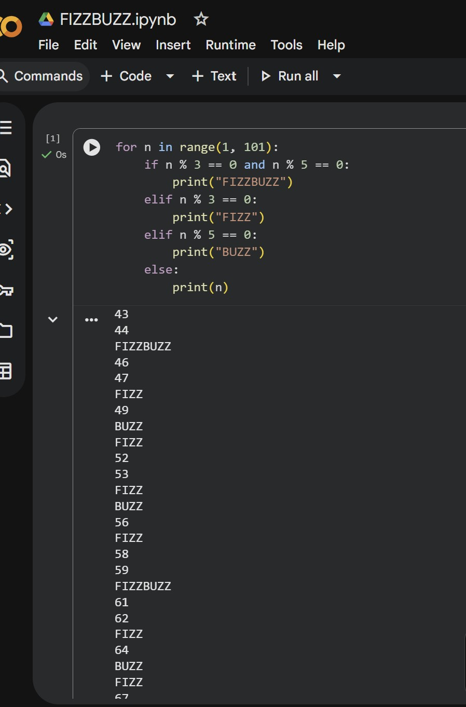

### **Notebook:**
[Open FIZZBUZZ.ipynb](FIZZBUZZ_Task/FIZZBUZZ.ipynb)

---

## Student.CSV Project:

Dataset: `student.csv`

This task demonstrates 7 exercises:


**Exercise 1: Loading and Exploring the Data**

- Load CSV into Pandas DataFrame
- Display first 5 rows
- Get DataFrame info
- Get summary statistics

**Code Example:**
```python
import pandas as pd

df = pd.read_csv("student.csv")
df.head()
df.info()
df.describe()
```

### **Output Screenshots:**
Q1.
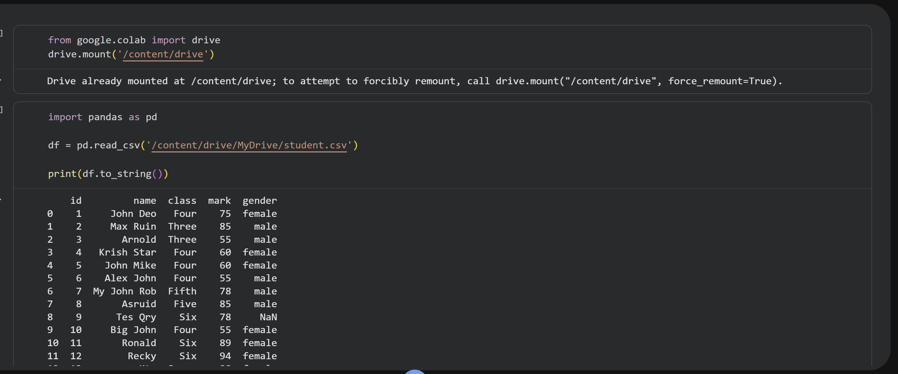
Q2.
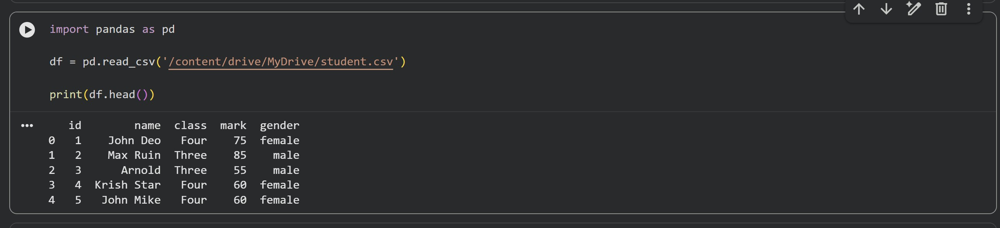
Q3.
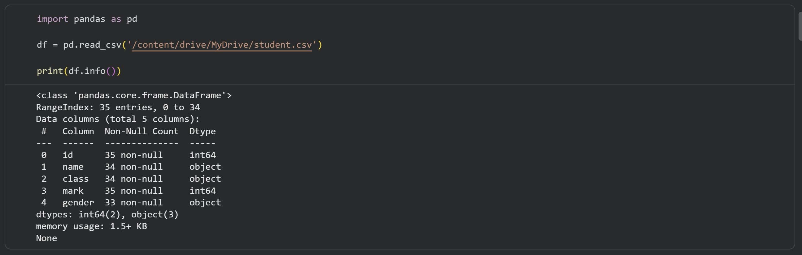
Q4.
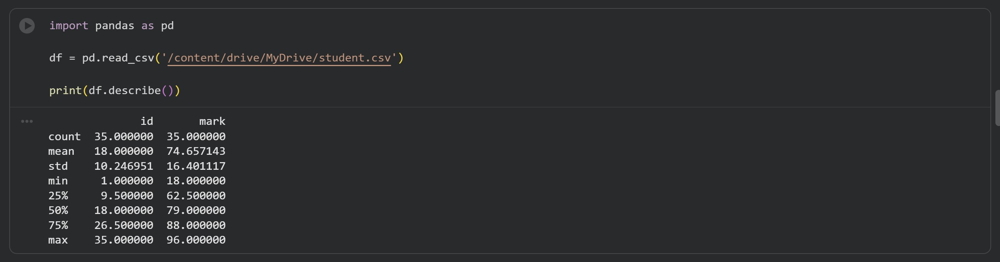

### **Notebook:**
[Open Python_student_project.ipynb](Student.cvs_Project/Python_student_project.ipynb)


**Exercise 2: Indexing and Slicing**

- Select columns and rows based on conditions

**Code Example:**
```python
df['name']                # Select 'name' column
df[['name','mark']]       # Select 'name' and 'mark' columns
df.head(3)                # First 3 rows
df[df['class'] == 'Four'] # Rows where class = 'Four'
```

### **Output Screenshots:**
Q1.
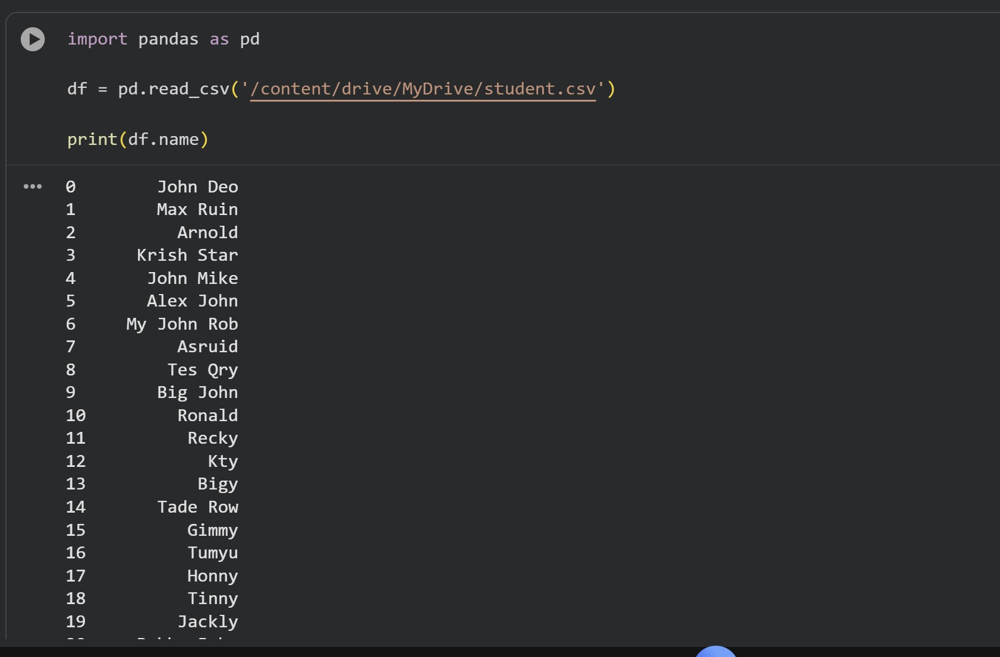
Q2.
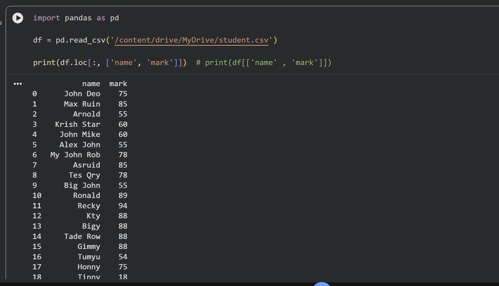
Q3.
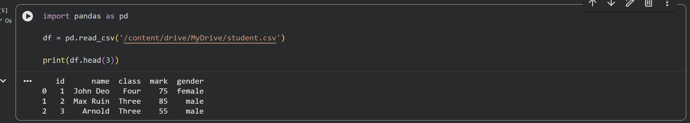
Q4.
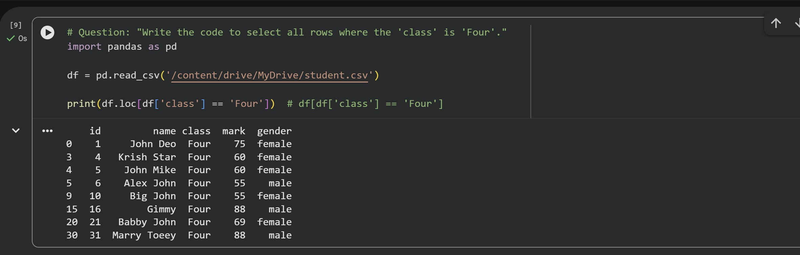

### **Notebook:**
[Open Python_student_project.ipynb](Student.cvs_Project/Python_student_project.ipynb)


**Exercise 3: Data Manipulation**

- Add 'passed' column
- Rename 'mark' to 'score'
- Drop 'passed' column

**Code Example:**
```python
df['passed'] = df['mark'] >= 60
df.rename(columns={'mark':'score'}, inplace=True)
df_drop_passed = df.drop(columns=['passed'])
```

### **Output Screenshots:**
Q1.
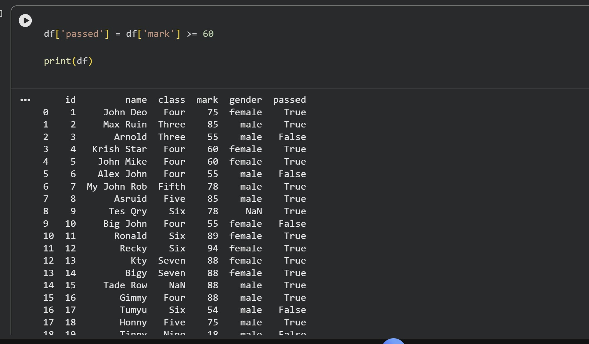
Q2.
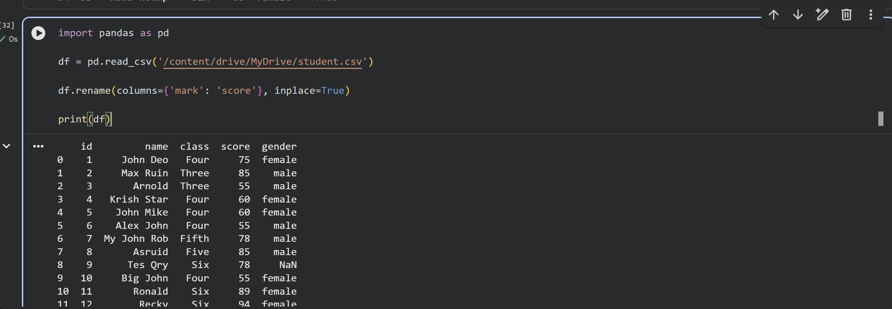
Q3.
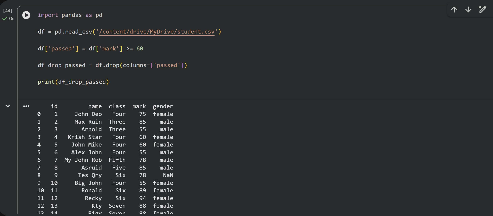

### **Notebook:**
[Open Python_student_project.ipynb](Student.cvs_Project/Python_student_project.ipynb)


**Exercise 4: Aggregation and Grouping**

- Group by class and calculate the mean score
- Count students per class
- Average mark per gender

**Code Example:**
```python
df.groupby('class')['mark'].mean()
df['class'].value_counts()
df.groupby('gender')['mark'].mean()
```

### **Output Screenshots:**
Q1.
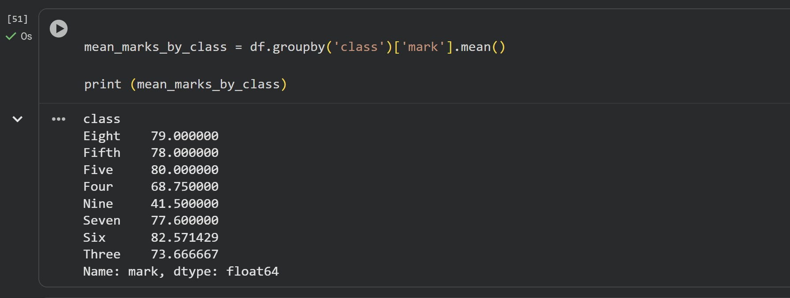
Q2.
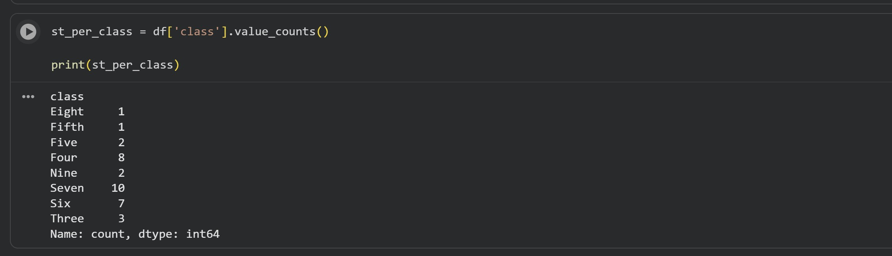
Q3.
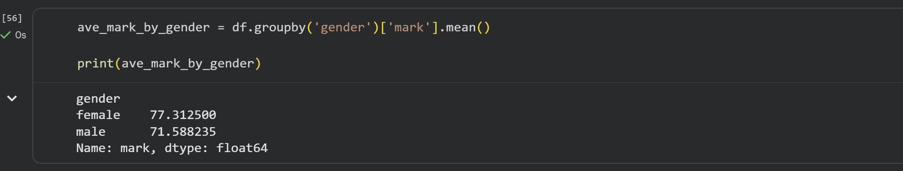

### **Notebook:**
[Open Python_student_project.ipynb](Student.cvs_Project/Python_student_project.ipynb)


**Exercise 5: Advanced Operations**

- Pivot table by class and gender
- Create grade column
- Sort by score descending

**Code Example:**
```python
pivot_table = pd.pivot_table(df, index='class', columns='gender', values='mark', aggfunc='mean')

def get_grade (mark):
  if mark >= 85: return 'A'
  elif mark >= 70: return 'B'
  elif mark >= 60: return 'C'
  else: return 'D'

df['grade'] = df['mark'].apply(get_grade)
df.sort_values(by='mark', ascending=False)
```

### **Output Screenshots:**
Q1.
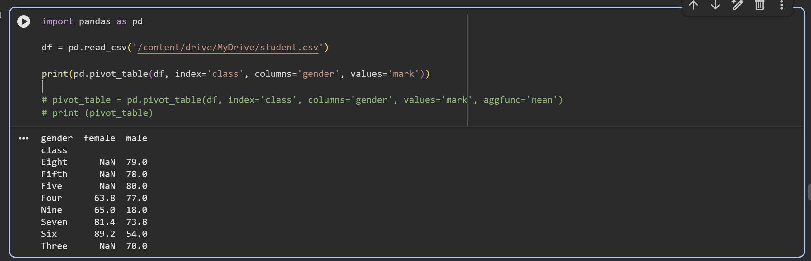
Q2.
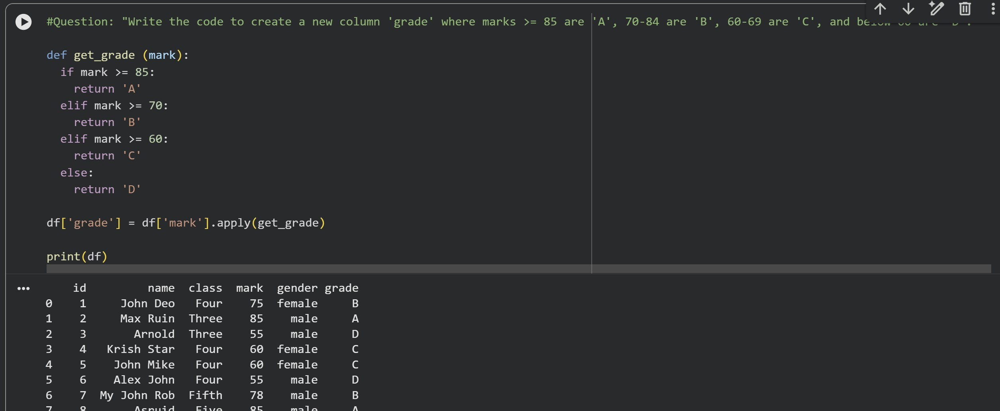
Q3.
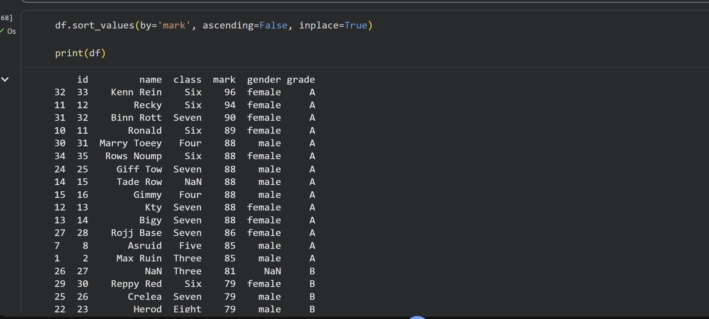

### **Notebook:**
[Open Python_student_project.ipynb](Student.cvs_Project/Python_student_project.ipynb)


**Exercise 6: Exporting Data**

- Save the DataFrame with grades to a new CSV

**Code Example:**
```python
df.to_csv("student_with_grades.csv", index=False)
```

### **Output Screenshot:**

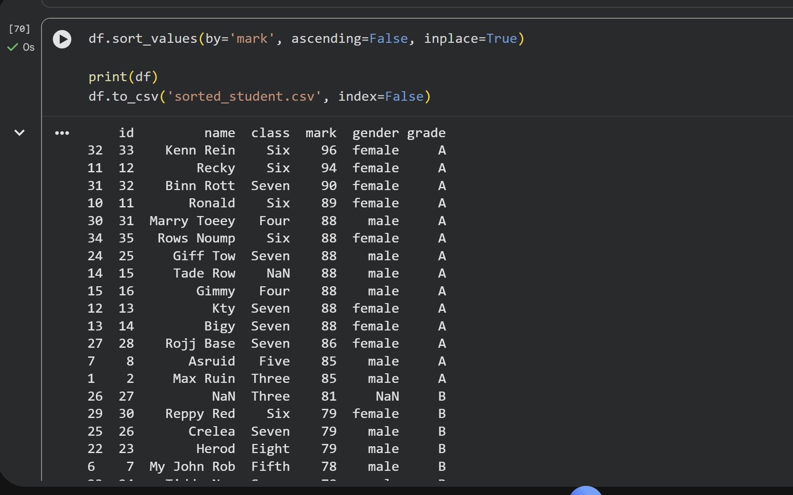

### **Notebook:**
[Open Python_student_project.ipynb](Student.cvs_Project/Python_student_project.ipynb)


**Exercise 7: Visualisation**

- create plots for marks, grades, or class distributions

  **Code Example:**
```python
from matplotlib import pyplot as plt
import seaborn as sns

# Plot number of students per grade
sorted_df.groupby('grade').size().plot(
    kind='barh',
    color=sns.palettes.mpl_palette('Dark2')
)

# Remove top and right borders
plt.gca().spines[['top', 'right']].set_visible(False)

plt.xlabel('Number of Students')
plt.ylabel('Grade')
plt.title('Number of Students per Grade')

plt.show()
```

### **Output Screenshots:**

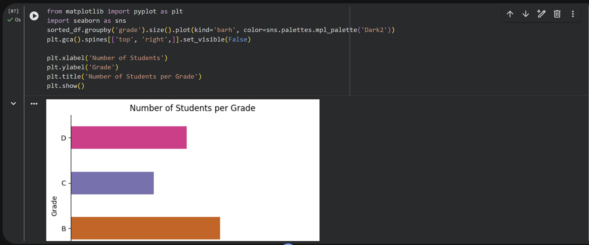
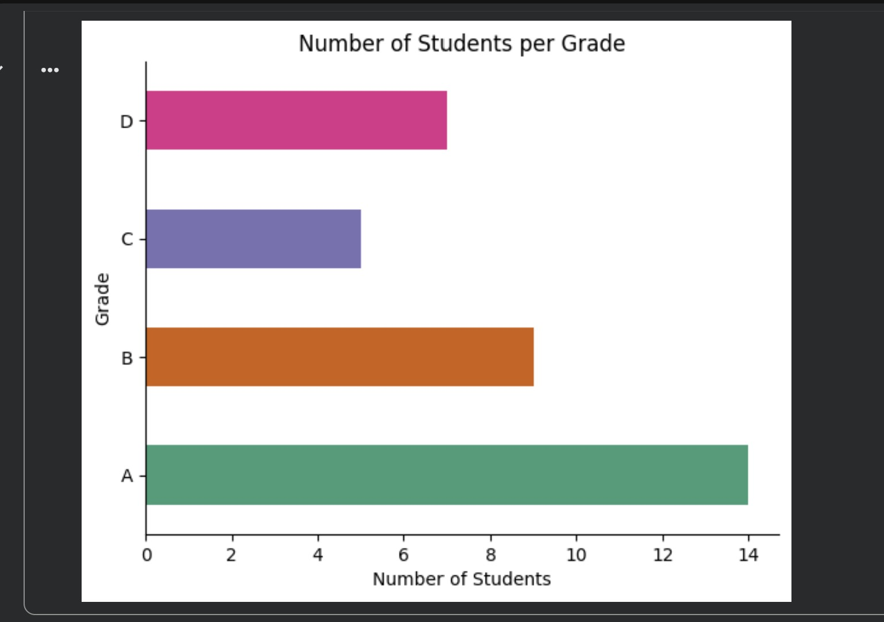

### **Notebook:**
[Open Python_student_project.ipynb](Student.cvs_Project/Python_student_project.ipynb)

---
<details>
<summary>Project Structure</summary>

```text
## Project Structure
Python_Data_Exercises/
│
├── FIZZBUZZ_Task/
│   ├── FIZZBUZZ.ipynb
│   └── FIZZBUZZ.jpg
│
├── Student.csv_Project/
│   ├── Python_student_project.ipynb
│   ├── student.csv
│   └── Screenshots/
│       ├── W6.Q1.1.jpg
│       ├── W6.Q1.2.jpg
│       ├── W6.Q1.3.jpg
│       ├── W6.Q1.4.jpg
│       ├── W6.Q2.1.jpg
│       ├── W6.Q2.2.jpg
│       ├── ...
│
└── README.md
```
---

## ***Requirements
The following Python libraries were used in this project:

- pandas  
- numpy  
- matplotlib  
- seaborn  

These libraries are commonly used for data cleaning, exploration, analysis, and visualisation in Python.
